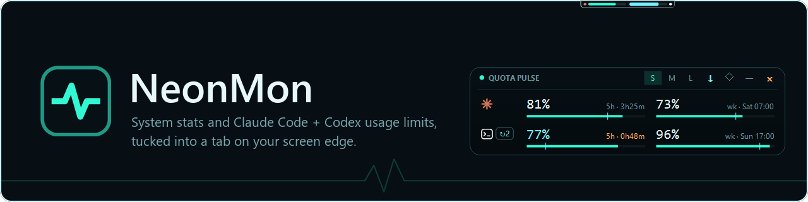
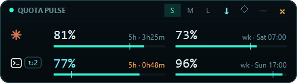
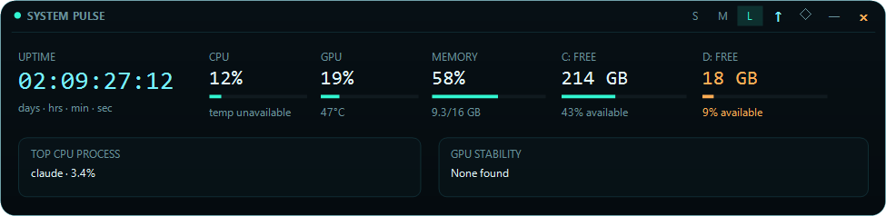
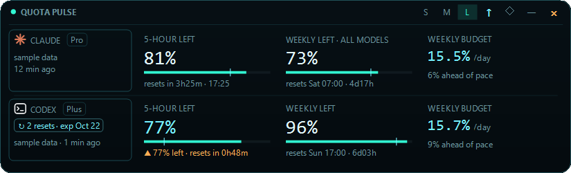

<p align="center">
  
</p>

<p align="center">
  <a href="https://github.com/AweGuider/NeonMon-Windows-Desktop-Widget/actions/workflows/build.yml"></a>
  <a href="https://github.com/AweGuider/NeonMon-Windows-Desktop-Widget/releases"></a>
  <a href="LICENSE"></a>
  
  <a href="https://ko-fi.com/awedev"></a>
</p>

<p align="center">
  <a href="#why-neonmon">Why NeonMon</a> ·
  <a href="#what-it-is">What it is</a> ·
  <a href="#highlights">Highlights</a> ·
  <a href="#quota-pulse-data-sources">Data sources</a> ·
  <a href="#build-and-run">Build and run</a> ·
  <a href="docs/gallery.md">Gallery</a> ·
  <a href="docs/devlog.md">Devlog</a> ·
  <a href="SECURITY.md">Security</a>
</p>

## Why NeonMon

NeonMon keeps system health and limited AI-agent quota visible at a glance without stealing focus, occupying the taskbar, or making you repeatedly open separate apps. You catch resource pressure early and always know how much Claude Code and Codex capacity is left, and when it resets, while you work.

## What it is

NeonMon sits on the edge of your screen as a small tab. Hover over it for a quick glance, click it to open the full panel, and move away to let it tuck back in. It never takes a taskbar slot and does not steal focus.

It has two strips:

- **System pulse** shows uptime, CPU and GPU load and temperature, memory, free disk space, the busiest process, and recent GPU-timeout diagnostics.
- **Quota pulse** shows Claude Code and Codex 5-hour and weekly limits side by side, counting down from 100%, with reset times, a weekly pace marker, a daily budget, and Codex reset credits.

| Hidden | Peek | Open |
| --- | --- | --- |
| A tab on the screen edge | Hover for the headline numbers | Click for the full panel |
|  |  <br>  |  |





More screenshots are in the [gallery](docs/gallery.md), and the [devlog](docs/devlog.md) shows how the UI evolved.

## Highlights

- **Out of the way:** hidden by default and never steals focus. Strips stay above fullscreen apps by default, or can hide while a fullscreen app runs on the primary monitor (**Settings → General → Over fullscreen apps**).
- **Light:** sampling pauses while a strip is hidden. Measured with both strips hidden, NeonMon uses about 0.1% of one CPU core and about 35 MB of memory.
- **Multi-monitor:** put each strip on any monitor, dock it to any edge, and drag it along that edge. **Follow mouse** moves a hidden strip to whichever monitor the pointer is on. Text and layout scale correctly across monitors with different scaling.
- **Readable anywhere:** the hidden tab pairs a dark body with a light ring, so it stays visible on white pages, bright video, and dark fullscreen video alike.
- **Three layouts:** small, medium, and large for each strip.
- **Your peek:** choose what System pulse shows on hover: load, temperatures, memory, any drive, and uptime.
- **Settings window:** every option grouped by pulse, and either pulse can be turned off if you only want one.
- **No paid API usage:** Quota pulse never calls a model and never uses API keys (see below).
- **Optional local JSON bridge** for your own dashboards.
- **Update notice:** once a day NeonMon asks GitHub whether a newer release exists and tells you once per version. It reads the public release list only, sends no account or usage data, and never downloads or installs anything. Turn it off with **Settings → General → Check for updates**.

## Quota pulse data sources

Quota pulse never calls a model and never uses API keys. Its sources are local:

- **Claude Code:** the plan limits Claude Code passes to its status line. This needs [Node.js](https://nodejs.org). The script ships as `tools\neonmon-statusline.js` next to `NeonMon.exe`, and **Copy setting** in **Settings → Quota pulse** copies the line below with the right path. Paste it into `~/.claude/settings.json`; it replaces any status line you already have:

  ```json
  "statusLine": { "type": "command", "command": "node \"<path-to-NeonMon>/tools/neonmon-statusline.js\"" }
  ```

  The script writes `%LOCALAPPDATA%\NeonMon\claude-statusline.json` whenever a CLI session renders its status line. The Claude desktop app does not run status lines, so Claude values refresh only when you use the `claude` CLI; older values are marked stale. **Open Claude CLI** in the Quota pulse menu opens a terminal and starts `claude` in the CLI folder set in **Settings → Quota pulse** (your user folder by default). **Open Codex CLI** works the same way for Codex.
- **Codex:** the recent session logs under `~/.codex/sessions`, plus a read-only `codex app-server` call (`account/rateLimits/read`) for fresh limits and reset credits: every 10 minutes while Codex is in use (2 or 5 in **Settings → Quota pulse**), every 45 minutes otherwise. The read does not consume quota.
- **Claude live endpoint fallback (off by default):** when enabled in **Settings → Quota pulse** and the statusline data is older than 2 minutes while the Quota pulse is revealed, 5 minutes while Claude is in use (2 or 10 in settings), or 45 minutes otherwise, NeonMon reads plan usage from `api.anthropic.com/api/oauth/usage` with the existing Claude CLI sign-in in `~/.claude/.credentials.json`. Claude counts as in use while the statusline, the endpoint's usage, or a Claude Code transcript under `~/.claude/projects` changes; NeonMon only receives change notifications for transcripts and never reads them. It only reads that file, never refreshes or stores tokens, waits at least two minutes between requests, backs off on errors, and skips the call when the sign-in has expired. The endpoint is undocumented and may change.

Values show remaining quota by default; switch to used quota with **Show quota as** in the Quota pulse menu or Settings. Run `NeonMon.exe --dump-quota quota.json` to write the current quota data to a file.

## Build and run

Requirements: Windows 10/11 and the .NET 9 SDK.

Double-click `build.bat`. It offers to close a running NeonMon, builds, and starts the new build (answer N to skip). The app is at:

```text
bin\Release\net9.0-windows\NeonMon.exe
```

Or use PowerShell:

```powershell
dotnet build -c Release --no-restore -p:TargetPlatformDisplayName=Windows
.\bin\Release\net9.0-windows\NeonMon.exe
```

**Settings → General → Start with Windows** adds a shortcut to your Startup folder that starts this copy at sign-in; if you move the folder, turn it off and on again.

Settings are stored in `%LOCALAPPDATA%\NeonMon\settings.json`. Launching NeonMon again opens the running copy instead of starting a second one, and `NeonMon.exe --exit` closes it.

## HTML integration

Enable **HTML bridge** in **Settings → General**, then fetch the local JSON endpoint:

```javascript
const metrics = await fetch('http://127.0.0.1:27171/api/v1/metrics')
  .then(response => response.json());
```

Quota data is available at `http://127.0.0.1:27171/api/v1/quota`.

The bridge is disabled by default, binds only to `127.0.0.1`, and accepts no commands. Browser pages can read it only from loopback origins (`http://localhost:*`, `http://127.0.0.1:*`). To allow another page, such as a hosted dashboard, add its exact origin to `HtmlBridgeAllowedOrigins` in `settings.json`:

```json
"HtmlBridgeAllowedOrigins": ["https://dashboard.example"]
```

## Currently unavailable

- Reliable fan RPM/duty telemetry. Many laptops do not expose a documented, dependable tachometer mapping, so NeonMon does not guess values or write embedded-controller registers.
- CPU temperature comes from vendor sensor interfaces (currently MSI's read-only WMI interface) and shows as unavailable on machines without one.

## Potential future features

- Warning thresholds.
- History graphs and lightweight data export.
- Native embeddable HTML component rather than JSON only.
- Packaged installer.
- Additional documented hardware sensor backends.

## Contributing

Issues and small pull requests are welcome. See [CONTRIBUTING.md](CONTRIBUTING.md) and the [Code of Conduct](CODE_OF_CONDUCT.md), and report security issues privately as described in [SECURITY.md](SECURITY.md).

## Support AweDev

If NeonMon saved you time, you can buy a cappuccino to support future releases and testing. Support is optional; NeonMon stays free.

[☕ Buy a Cappuccino on Ko-fi](https://ko-fi.com/awedev)

## License

[MIT](LICENSE) © 2026 AweDev
