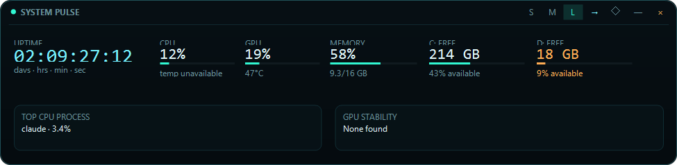
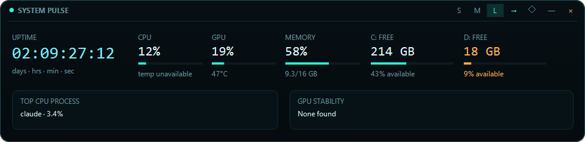
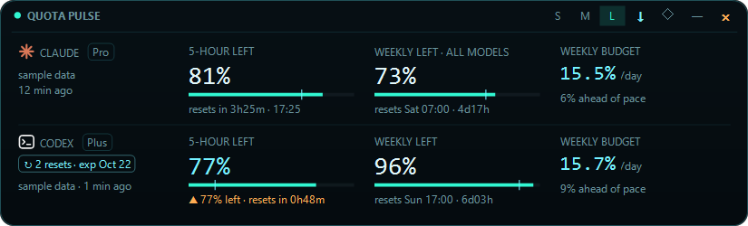
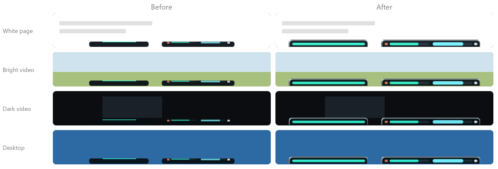
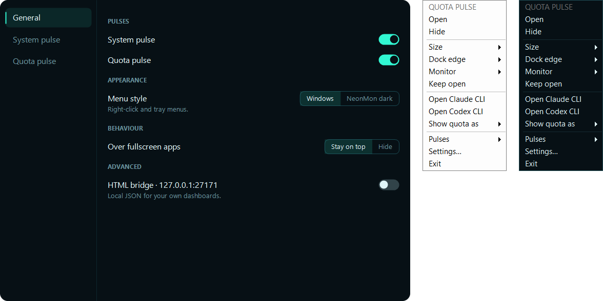

# Devlog

How NeonMon grew from a single system-monitor strip into a two-strip desktop widget. Every screenshot below is rendered by the build from that point in history.

[Back to the README](../README.md)

## October 1, 2026: first version

NeonMon started as one dockable strip: a thin line on the screen edge that expands into a system panel with uptime, CPU, GPU, memory, free disk space, the busiest process, and GPU-timeout diagnostics.

The first build had a DPI bug: at 125% scaling, the labels above each value were clipped at the top (look at UPTIME, CPU, and GPU).

The same day, the clipping was fixed across all three layouts, and drive cards became shortcuts that open the drive in File Explorer.

## October 5, 2026: Quota pulse

The goal: one glance at Claude Code and Codex usage limits, to get the most out of both subscriptions without opening either app.

Before writing code, the layout went through mockups. Decisions that came out of that review:

- One combined strip rather than a separate app, so it shares NeonMon's tray, settings, and edge behavior.
- Both providers count down from 100% remaining, the way Codex reports it, rather than Claude's 0-to-100% used.
- Claude first and Codex second, each marked with its own icon instead of text labels.
- Peek shows each provider's 5-hour value, plus the weekly value on an amber chip only when weekly is the tighter limit.
- Codex reset credits are shown with their earliest expiry.

**No paid API usage** was a hard rule. Claude limits come from the data Claude Code already passes to its status line, and Codex limits come from its local session logs plus a read-only app-server call. An optional fallback reads Claude's plan usage endpoint with the existing CLI sign-in. It is off by default, never refreshes tokens, and never calls a model.

Rendering also gained a fixed sample-data mode, so every UI change could be checked as pixel-identical against a baseline before and after.

## October 5, 2026: performance and robustness

A profiling pass cut idle cost. Sampling now pauses while strips are hidden, the expensive process scan only runs while the panel is open, and hidden strips repaint only when what they show actually changes.

| | Before | After |
| --- | --- | --- |
| CPU, strips hidden | 0.52–0.70% of one core | 0.09–0.16% of one core |
| Private memory | 39 MB | 33–34 MB |

Measured by alternating before and after builds on the same machine.

Robustness work followed: single instance (launching again opens the running copy), recovery from display and taskbar changes, fullscreen handling, and origin checks on the local JSON bridge.

Smaller additions: the app icon, a visible reason when Claude data is stale (such as an expired CLI sign-in), a one-click **Open Claude CLI** shortcut to refresh it, and an immediate refresh when you peek.

## October 5, 2026: owner notes round

Feedback from daily use became the next batch:

- **Fullscreen:** strips were disappearing behind fullscreen apps. Windows can drop always-on-top windows below a newly focused fullscreen window, so NeonMon now re-asserts on-top after every focus change. Staying visible is the default, and hiding is an option.
- **Multiple monitors:** each strip can be moved to any monitor and remembers it. **Follow mouse** moves a hidden strip to the monitor the pointer is on. Testing on two monitors with different scaling exposed text drawn 25% too large on the second one, so fonts are now sized for each monitor's DPI.
- **Visibility:** the old hidden strip, a dark sliver with a thin line, nearly vanished on white pages and on dark video. Three designs were mocked up on four backgrounds, and a combination won: a tab hanging off the screen edge (its flat side against the edge) with a dark body, a bright bar, and a light outer ring.

## October 6, 2026: fixes and CLI buttons (v0.2.0)

The first outside pull request fixed three real problems: **Open Claude CLI** failed on the native Claude installer, the strip menu could crash on PCs with more than one keyboard layout, and several open Claude Code sessions made the quota values jump. A follow-up kept a reset window at 100% instead of showing "no data".

The Claude and Codex blocks in Quota pulse became visible buttons with a thin outline, Codex got its own **Open Codex CLI**, and a CLI that isn't installed now says so. The status line script ships with the build, with a menu item that copies its Claude setting. Uptime now counts from the last power-on or wake, because Windows Fast Startup kept the old counter running through shutdowns.

## October 6, 2026: settings and pulses (v0.3.0)

The right-click menu had grown into one long list where strip options, app-wide options, and Quota-only options sat side by side, with nothing saying which pulse an item affected. After a round of mockups, it split into two parts:

- **Short menus:** each strip's menu is headed by its name and holds only that strip's options. Quota pulse adds its CLI shortcuts. The tray icon got its own menu.
- **A Settings window:** General, System pulse, and Quota pulse pages, with every option labelled and short explanations where an option isn't obvious. It is drawn in the same dark style as the strips, and the menus can follow it with an optional dark style.

Every pulse can now be turned off. A pulse that is off is hidden and does no background work, and with both off NeonMon stays in the tray. The Claude and Codex CLI shortcuts open in a folder you pick.

Two feature requests from the same contributor shape v0.4.0.
