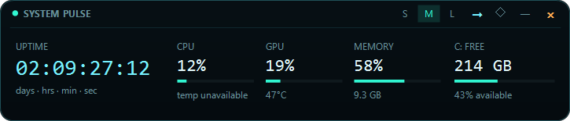
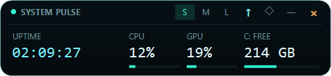
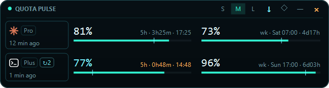
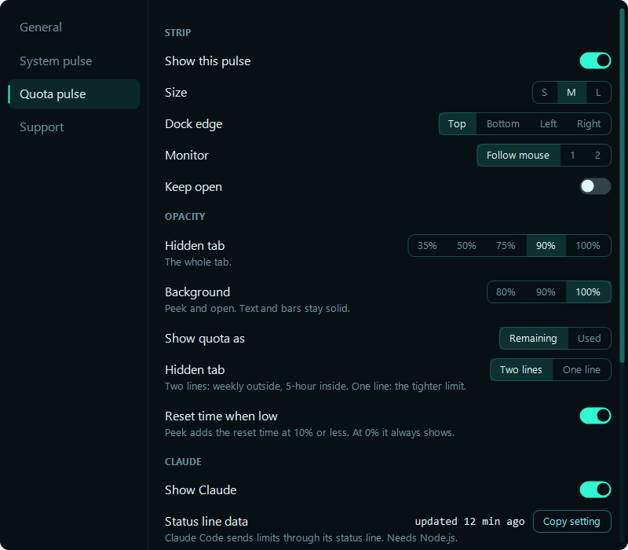

# Gallery

All screenshots are rendered by NeonMon itself (`NeonMon.exe --render-preview <file> <size> --strip <system|quota> --state <Hidden|Peek|Open> --sample`, and `--render-settings <file> <General|System|Quota|Support> --sample` for the Settings window) at 125% scaling with fixed sample data, so they are reproducible and contain no live system data.

[Back to the README](../README.md)

## System pulse

**Large**

**Medium**

**Small**

## Quota pulse

Claude Code is listed first and Codex second. Values count down from 100% remaining. The tick on each bar marks where usage would be at an even pace through the window, the amber ▲ line is a "use it or lose it" hint (at least half the 5-hour quota is left but it resets within an hour), and the chip under Codex shows available reset credits and the earliest expiry.

**Large**

**Medium**

**Small**

## Peek

Hovering over a tab shows the headline numbers without opening the panel. Quota pulse shows each provider's 5-hour value, plus the weekly value on an amber chip when the weekly quota is the lower of the two. System pulse shows CPU and GPU load, free space on the system drive, and uptime by default; a drive turns amber when it is nearly full. **Settings → System pulse → Peek** picks the values, including temperatures, memory, and other drives.

 &nbsp; 

## Hidden tabs

The hidden state is a small tab hanging off the screen edge: a dark body with bright bars, inside a light outer ring. The system tab shows CPU load on the inner line and GPU load on the line nearest the screen edge, averaged over 15 seconds; **Settings → System pulse → Hidden tab** picks up to two metrics, or none for a plain bar. The quota tab shows two lines, split into a Claude half and a Codex half with brand-colored circles at the ends: the weekly limit on the line nearest the screen edge, outlined in amber, and the 5-hour limit inside it. **Hidden tab → One line** in the Quota pulse menu switches back to a single line showing whichever limit is tighter.

## Settings

**Settings…** in any menu opens a window with a page for each pulse, general options, and support links. The right-click menus can also switch to a dark style there.

